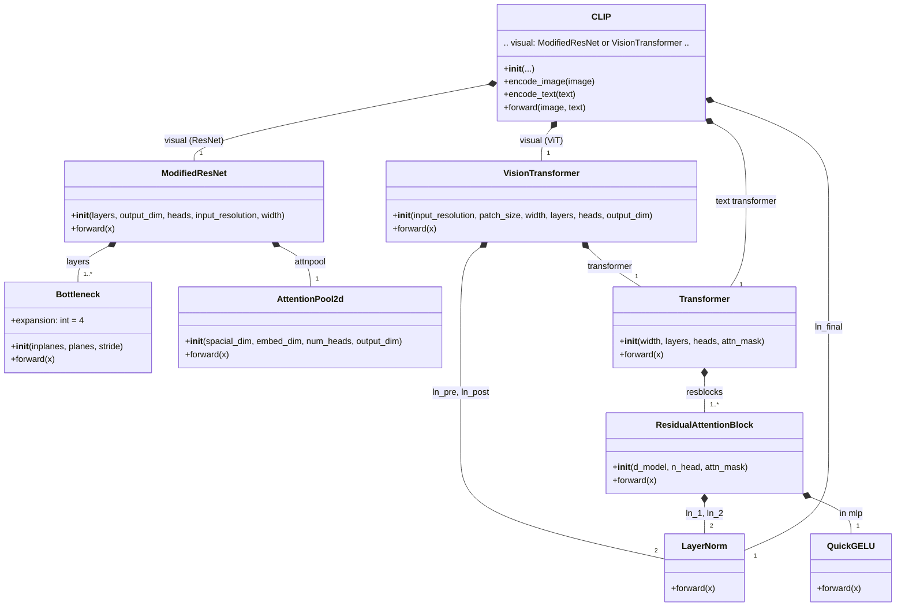

# :rocket:Model Introduction:rocket:

## :house:1.CLIP Architecture:house:

在构造CLIP模型时，代码通过分层模块化设计手动构建了各组件的依赖关系：首先定义基础构件如Bottleneck(用于ModifiedResNet)、AttentionPool2d(实现注意力池化)和ResidualAttentionBlock(Transformer基本单元)，再以此为基础分别搭建ModifiedResNet(适用于CNN主干)和VisionTransformer(适用于ViT主干)两种视觉编码器；同时构建文本侧的Transformer编码器，并将两者统一集成到CLIP主类中——CLIP根据vision\_layers的类型自动选择视觉主干，通过共享的embed\_dim对齐图像与文本特征空间，并利用可学习的logit\_scale调节相似度输出；整个依赖链自底向上，从底层卷积/注意力操作到高层多模态对齐逻辑，层层封装、参数协同，最终形成端到端的对比学习架构。具体的代码可以在[clip.py](dl_exam/vlm/clip/model.py)详细阅览，并且该代码参考学习的是[Openai-CLIP](https://github.com/openai/CLIP.git)仓库。

